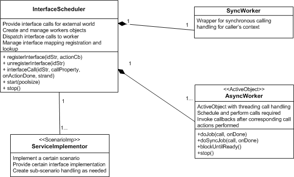
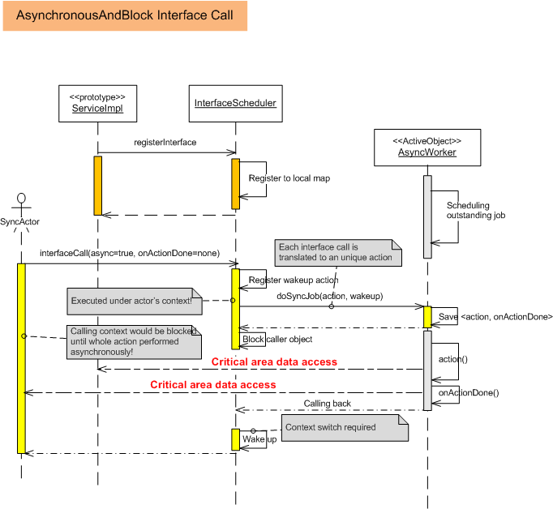
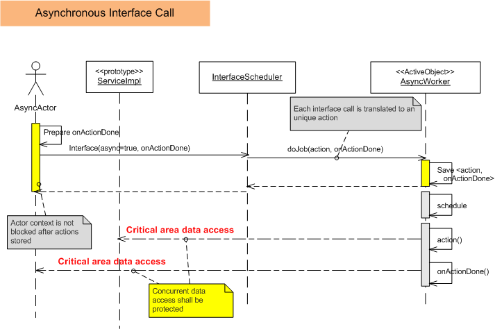
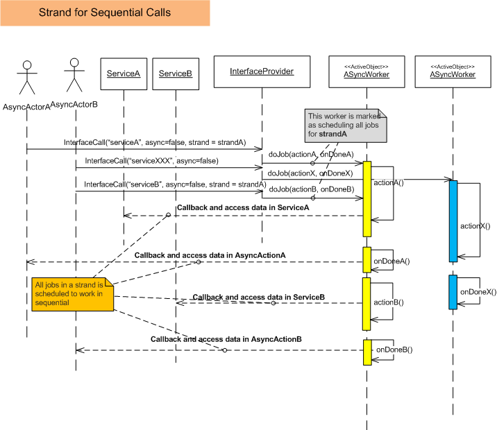

Overview
===========
A library providing facilities to register interface calls and for clients (interface users) to schedule a call asynchronously or synchrously. Typically an interface **shall be registered firstly** with the actual action (can be a closure wrapped by lambda) for later call; a client can invoke the call by specifing various properties as specified below.

Calling Properties
--------------------
Below calling properties are supported:

* asynchronous/synchronous

If a call is specified as synchronous, the call will be run instantly within the same context (thread) and caller would be blocked natually. Asynchronous calls can be specified as blocked for completion.

* block/unblock

If a call is specified as unblock (not waiting for done), the call might be deferred, while passed in parameters would be stored (as a closure) and applied when actual call happens later.

If a call is blocking, the caller's context would be suspended until actual call is handled.

* onActionDone

A closure (typically wrapped by ordinary function or lambda) can be attached to a specifc call, such that when the deferred call (or instant call within same context) is actually invoked and returned, *onActionDone* would be called immediately **within same context as actual call site**/ 

* strand

A strand is used to force sequenial execution of mutliple calls - when mutliple calls (invocations) specify the same strand name, they will be executed strictly like a strand. This would be useful when sharing data between threads are not desired (no concurrent data protection required), or when the actual sceneraios demands strict sequence.

Variadic Arguments and Example Usage
---------------------------------------
Since the interface registered may demands external inputs as arguments (typically wrapped by **std::placeholders::_x**) that can only be bounded during calling site, it's supported to bind the actual passed parameters to the stored closure (by lambda) and actually apply them during action execution.

A helper function is provided to facilitate the registration by explicitly declare the argument types signature, for example:
    
    //registration
    InterfaceScheduler sched;
    sched.start(4); //starting threading pool of 4 threads;

    bool serviceImpl(int, std::string);
    registerInterfaceFor<int, std::string>(sched, "service", serviceImpl);

    //calling site
    CallProperty prop = {true, false, Callable(), ""}; //asynchronous call, non-blocking, doesn't care done notification, no strand
    sched.interfaceCall("service", std::forward<CallProperty>(prop), 1, "actualParam");

When the actual service get called asynchronously, `serviceImpl(1, "actualParam")` will be executed.

Build and Run Tests
=======================
Two variants of builds are supported on top of cmake:
* Native build (requires gcc4.7 or later, or clang), when you don't have SDK installed.
* SDK build - can detect PS_LFS_REL SDK and use that by default, as long as your machine has SDK installed.
To force the variant, passing `-DuseSDK=ON` or `-DuseSDK=OFF` to cmake command when generating binary tree.

Build Steps
-------------
Typical cmake work flow shall work:

    mkdir bld #the binary tree to store the build result
    cd bld
    cmake ../
    make

Supported Targets
--------------------
Below targets are supported:
* default : will generate all binaries and libraries
* ut: generate unit testing binary
* runUT: run all test cases once
* runStress: run all test cases for 100 times (to detect possible race conditions); test will stop on first failure case and generate a core dump file for further analysis/debugging.

Design Documents
=================
The `interfaceScheduler.hpp` is the main interface for external use, others shall be hidden from external accessing. A typical scenairo of usage is described in above section (example usage).

Class Responsibility and Collaboration
---------------------------------------

Secenario Examples
--------------------

